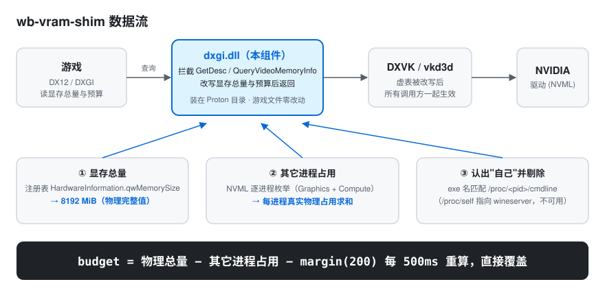

# wb-vram-shim

[](LICENSE)
[](#%E5%89%8D%E6%8F%90)
[-green)](winepart/wb_vram_dxgi.c)
[](#%E5%89%8D%E6%8F%90)

**让 Wine / Proton 上的 DXVK·vkd3d 游戏真正用上完整的显存。**

一个纯 C 的 `dxgi.dll`，安装为 **Proton 部件**（游戏文件零改动），把游戏看到的显存预算从
"驱动的保守估算"替换为**实时计算的物理真值**：

```
budget = 物理显存总量 − 其它进程实际占用(NVML 逐进程枚举) − margin
```

每 500 ms 重算一次——桌面变干净额度自动变大，游戏自己吃掉的占用**不会**反过来压缩自己的额度。

---

## 这解决什么问题

在 Linux + Proton 下，DX12 游戏通过 DXGI 拿到的显存**预算**（Budget）远低于物理显存，
而且游戏越分配、预算越缩水，导致游戏主动缩池、贴图降级。实测（RTX 3070 8 GB / GTA V Enhanced）：

| | 无补丁 | 装 wb-vram-shim |
|---|---|---|
| 游戏实际可占用 | **≈ 5.0 GiB** | **≈ 6.2 GiB（+1.2 GiB）** |
| 游戏看到的额度 | 5861 MiB（动态缩水） | **恒定、我们自己算的值** |
| 显存总量上报 | 8160 MiB | 8192 MiB（物理完整值） |

驱动给的预算为什么"错"、根因链条长什么样 → 详见 [`docs/INVESTIGATION.md`](docs/INVESTIGATION.md)（完整调研记录，源码级取证）。

## 工作原理

DXVK / vkd3d-proton / dxvk-nvapi 的显存上报全部经过同一张 DXGI 适配器虚表，
所以只需要一个组件、一处挂钩，整条链一起生效：



三个设计要点：

1. **总量取真值** —— 从注册表 `HardwareInformation.qwMemorySize` 读物理完整值（8192 MiB），
   而不是驱动上报时扣掉保留后的 8160。
2. **"其它进程"是实测不是估算** —— 用 NVML 的进程枚举（`nvmlDeviceGetGraphicsRunningProcesses_v2`）
   拿到每个进程的真实显存占用，求和。
3. **认自己不靠 `/proc/self`** —— Wine 下 `/proc/self` 指向 **wineserver** 而不是调用进程
   （我们用独立 PE 探针实测证实），改用 exe 名匹配 `/proc/<pid>/cmdline`，认到一次即缓存。

## 快速开始

**前提**：NVIDIA 显卡 + 游戏使用 **GE-Proton** 启动（Wine 的 NVML 垫片仅 GE-Proton 自带，
且实测无法跨 Proton 移植）。

```bash
git clone https://github.com/ronman2009/wb-vram-shim.git
cd wb-vram-shim
./winepart/install-v2.sh          # 自动定位 Proton、安装、备份原件
```

然后直接启动游戏——**不需要任何启动项参数**。首次启动建议看一眼日志确认：

```
<steam-prefix>/drive_c/users/steamuser/AppData/Local/Temp/wbvram.log
```

应能看到：`[NVML] 枚举进程=N 个 … 除自己外合计=X MiB ; 自己=pid <pid> => budget=Y MiB`。

**管理命令**（都在一键入口里）：

```bash
./winepart/install-v2.sh --status      # 看当前装的是哪一版
./winepart/install-v2.sh --dry-run     # 只打印将要执行的动作
./winepart/install-v2.sh rollback      # 急救：恢复官方 dxgi.dll 并清理痕迹
```

## 配置（全部可选）

默认行为无需任何配置。以下开关加在 Steam 启动项 `%command%` **前面**：

| 变量 | 默认 | 作用 |
|---|---|---|
| `WBVRAM_MARGIN_MB` | `200` | 安全垫；越小给游戏越多，也越贴边 |
| `WBVRAM_DYNAMIC` | `1` | `0` = 退回固定余量模式（`total − WBVRAM_RESERVE_MB`） |
| `WBVRAM_RESERVE_MB` | `1536` | 固定余量模式的保留值 |
| `WBVRAM_DRYRUN` | `0` | `1` = 只观测不改写（拿数据用） |
| `WBVRAM_ALL` | `0` | `1` = 取消 appid 白名单（默认只对本配置过的游戏生效） |

完整参数与日志说明 → [`winepart/README.md`](winepart/README.md)。

## 兼容性与边界

- ✅ DXVK / vkd3d-proton / dxvk-nvapi 的所有显存查询（同一张虚表）
- ✅ 32 位游戏不受影响（只装 `x86_64-windows`）
- ⚠️ **仅 GE-Proton 系**：NVML 垫片跨 Proton 移植实测不可用；非 GE-Proton 下自动退回
  固定余量模式（依然有界、不会乱报），但拿不到动态值
- ⚠️ **谎报预算不产生显存**：天花板是 `物理总量 − 真实其它占用`，margin 别压太小
- ⚠️ **联机反作弊**：本组件在进程内改写 DXVK 虚表，BattlEye 等用户态反作弊可以枚举到
  外来 `dxgi.dll`。**单人/故事模式使用，进联机前请 `rollback`**——风险自行判断。
- 🔄 Steam「验证 Proton 文件完整性」或 Proton 更新会还原官方 `dxgi.dll`，
  重跑一次 `install-v2.sh` 即可（原件备份自动登记，不会被污染）。

## 工程质量

- 干净重建**零警告**；导出表与 DXVK 原生 dxgi 完全一致（5 个导出）；`winedump` 校验合法 PE32+
- **宿主端测试台 13 场景**（假 DXVK + 假 NVML + 假 `/proc`，不需要 GPU），含
  IID 校验回归、污染事故复刻、认不出自己的保守兜底
- **安装器自检 43 断言**（幂等、备份保护、卸载逐字节还原、版本识别）
- 三层兜底全部有界：精确值 / 偏保守值 / 静态值——**不存在虚高路径**

## 文档

| 文档 | 内容 |
|---|---|
| [`winepart/README.md`](winepart/README.md) | 主组件：安装、卸载、回滚、全部参数、日志解读 |
| [`winepart/v1fix/README.md`](winepart/v1fix/README.md) | 对照组版本（仅修 IID 的 v1，A/B 归因用） |
| [`docs/INVESTIGATION.md`](docs/INVESTIGATION.md) | 完整调研记录：根因链、每版迭代、实测数据、踩坑复盘 |

## License

[MIT](LICENSE) © 2026 ronman2009
